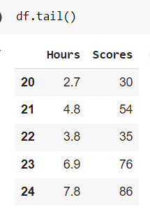
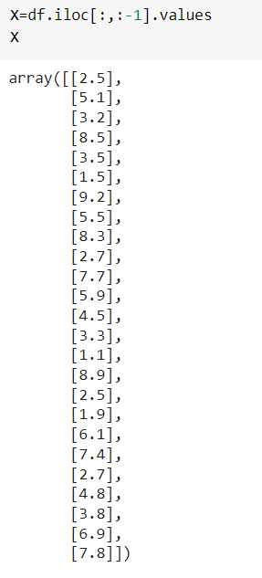
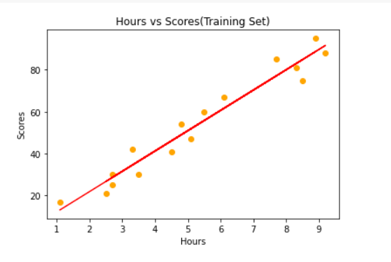
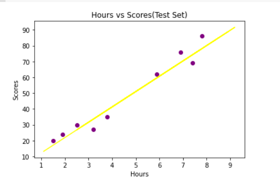

# Implementation-of-Simple-Linear-Regression-Model-for-Predicting-the-Marks-Scored

## AIM:
To write a program to predict the marks scored by a student using the simple linear regression model.

## Equipments Required:
1.Hardware – PCs\
2.Anaconda – Python 3.7 Installation / Moodle-Code Runner

## Algorithm
1.Use the standard libraries in python for Gradient Design.\
2.Set variables for assigning dataset values.\
3.Import linear regression from sklearn.\
4.Assign the points for representing in the graph.\
5.Predict the regression for marks by using the representation of the graph.\
6.Compare the graphs and hence we obtained the linear regression for the given datas. 

## Program:
```
/*
Program to implement the simple linear regression model for predicting the marks scored.
Developed by: Kirupanandhan.T
RegisterNumber:212221230051

import pandas as pd
import numpy as np
import matplotlib.pyplot as plt
df=pd.read_csv('student_scores.csv')

#displaying the content in datafile
df.head()
df.tail()

#segregation data to variables
X=df.iloc[:,:-1].values
X
Y=df.iloc[:,1].values
Y

#spliting train and test data
from sklearn.model_selection import train_test_split
X_train,X_test,Y_train,Y_test=train_test_split(X,Y,test_size=1/3,random_state=0)

from sklearn.linear_model import LinearRegression
regressor=LinearRegression()
regressor.fit(X_train,Y_train)
Y_pred=regressor.predict(X_test)

#displaying predicted value
Y_pred

#displaying actual value
Y_test

#graph plot for training data
plt.scatter(X_train,Y_train,color="orange")
plt.plot(X_train,regressor.predict(X_train),color="red")
plt.title("Hours vs Scores(Training Set)")
plt.xlabel("Hours")
plt.ylabel("Scores")
plt.show()

#graph plot for test data
plt.scatter(X_test,Y_test,color="purple")
plt.plot(X_train,regressor.predict(X_train),color="yellow")
plt.title("Hours vs Scores(Test Set)")
plt.xlabel("Hours")
plt.ylabel("Scores")
plt.show()

mse=mean_squared_error(Y_test,Y_pred)
print('MSE = ',mse)
mae=mean_absolute_error(Y_test,Y_pred)
print('MAE = ',mae)
rmse=np.sqrt(mse)
print('RMSE = ',rmse)
*/
```

## Output:








## Result:
Thus the program to implement the simple linear regression model for predicting the marks scored is written and verified using python programming.
